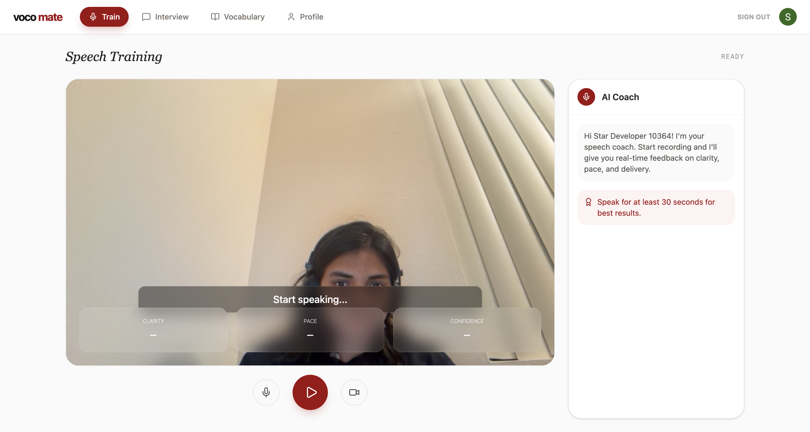
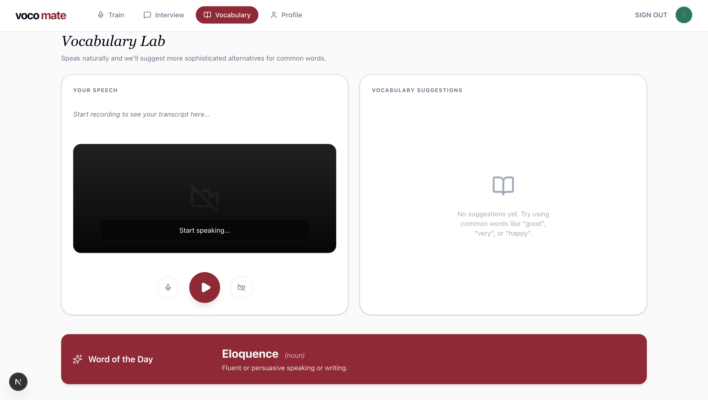
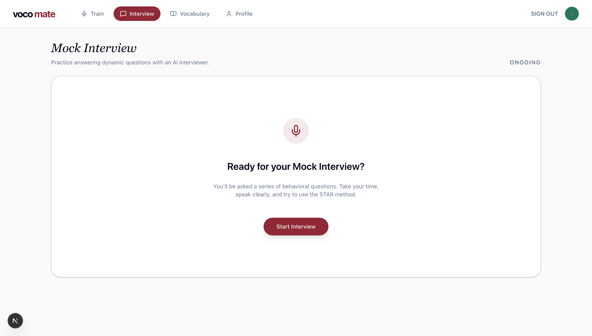

# 🎤 VocoMate – AI Speech Training Platform

VocoMate is an AI-powered speech training platform designed to help users improve their speaking skills through real-time feedback, mock interviews, and vocabulary enhancement.

It enables users to practice speeches, prepare for interviews, and refine communication skills with live AI coaching.

---

## 🚀 Features

### 🧠 Train Mode
- Live speech-to-text transcription
- Real-time feedback on:
  - Clarity
  - Pace
  - Confidence
- AI coaching suggestions during speech
- Post-session analysis with actionable insights

### 🎯 Interview Mode
- AI-driven mock interviews
- Dynamic follow-up questions
- Performance scoring:
  - Relevance
  - Structure
  - Confidence
- Detailed feedback and improved answer suggestions

### 📚 Vocabulary Mode
- Detects basic/common words in speech
- Suggests advanced alternatives
- Word of the Day feature
- Save and track learned vocabulary

### 📊 Profile & Progress
- Track speaking performance over time
- View session history
- Analyze trends in clarity, pace, and confidence
- Monitor consistency and improvement

---

## 🖼️ Screenshots

### 🎤 Train Mode


### 📚 Vocabulary Lab


### 🤖 Interview


### 🤖 Profile


---

## 🛠️ Tech Stack

**Frontend**
- Next.js (App Router)
- React + TypeScript
- Tailwind CSS
- shadcn/ui

**Backend**
- Next.js API Routes / Server Actions
- Node.js

**Database**
- PostgreSQL
- Prisma ORM

**AI & Speech**
- Speech-to-Text (Whisper / Vosk)
- OpenAI (feedback, scoring, interview simulation)

---

## 📦 Installation

```bash
# Clone the repo
git clone https://github.com/your-username/vocomate.git

# Navigate into the project
cd vocomate

# Install dependencies
npm install

# Setup environment variables
cp .env.example .env